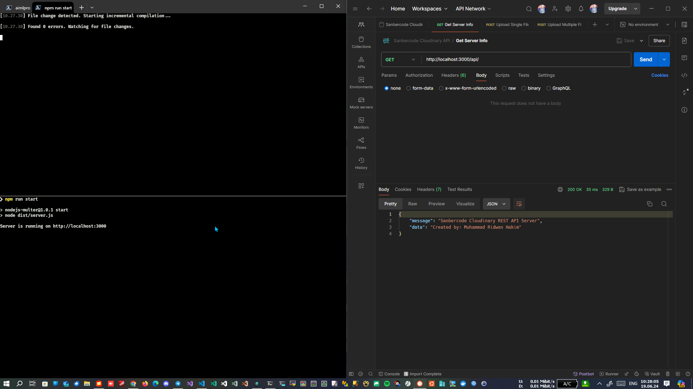
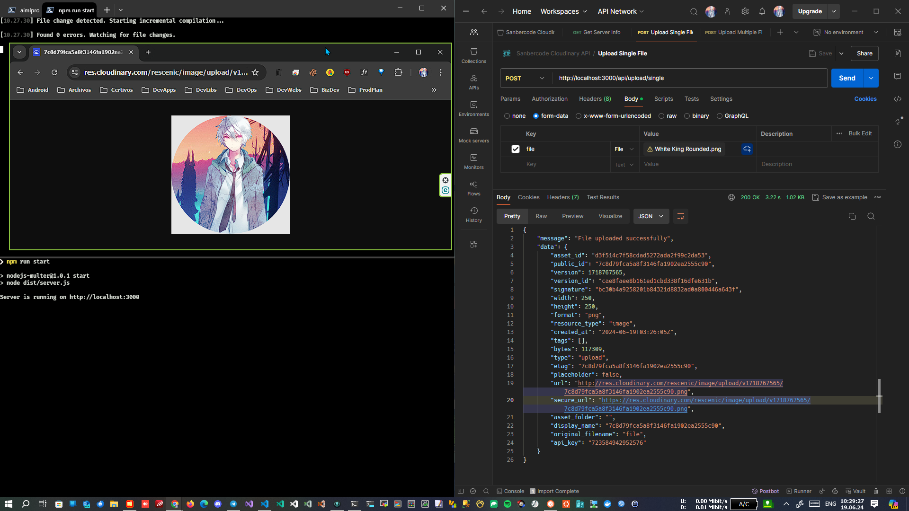
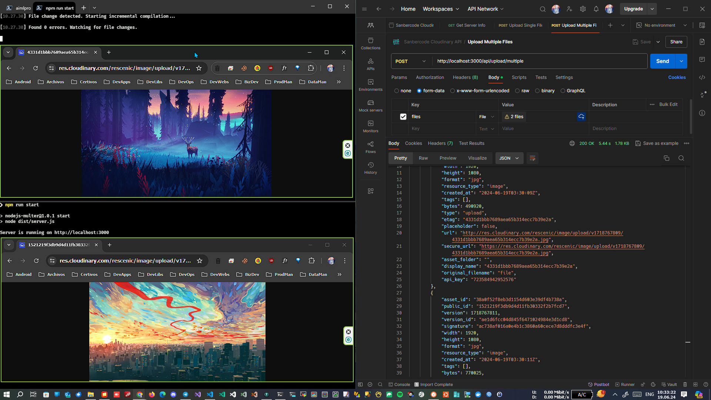

# Tugas 7 Sanbercode Cloudinary API - Node.JS Backend

## Muhammad Ridwan Hakim

### Deploy Localhost

```bash
-------------------
First Terminal
-------------------
git clone https://github.com/rescenic/nodejs-tugas7.git

cd nodejs-tugas7

npm install

npm run build:watch
-------------------
Second Terminal
-------------------
cd nodejs-tugas7

npm run start
```

### Import Sanbercode Cloudinary API.postman_collection.json to Postman

### Screenshots





### 🔖 API Documentation

#### 1\. Get /

- **Description:** Get server information.

- **Request**

- **Method:** GET

- **URL:** `/`

- **Response**

- **Status Code:** 200

``` json
{
  "message": "Sanbercode Cloudinary REST API Server",
  "data": "Created by: Muhammad Ridwan Hakim"
}
 ```

#### 2\. POST /api/upload/single

- **Description**: Upload a single file.

- **Request**

- **Method:** POST

- **URL:** `/api/upload/single`

- **Content-Type:** `multipart/form-data`

- **Body:**

  - `file`: The file to be uploaded.

- **Response**

- **Status Code:** 200

``` json
[
  {
    "asset_id": "your_asset_id",
    "public_id": "your_public_id",
    "version": 1234567890,
    "version_id": "your_version_id",
    "signature": "your_signature",
    "width": 800,
    "height": 600,
    "format": "jpg",
    "resource_type": "image",
    "created_at": "2024-06-19T12:00:00Z",
    "tags": [],
    "bytes": 123456,
    "type": "upload",
    "etag": "your_etag",
    "placeholder": false,
    "url": "http://res.cloudinary.com/your_cloud_name/image/upload/v1234567890/your_public_id.jpg",
    "secure_url": "https://res.cloudinary.com/your_cloud_name/image/upload/v1234567890/your_public_id.jpg",
    "folder": "",
    "original_filename": "file"
  }
]
 ```

- **Status Code:** 500 (if an error occurs)

``` json
{  "error": "Error message"}
 ```

#### 3\. POST /api/upload/multiple

- Description: Upload multiple files at once.

- **Request**

- **Method:** POST

- **URL:** `/api/upload/multiple`

- **Content-Type:** `multipart/form-data`

- **Body:**

  - `files`: An array of files to be uploaded.

- **Response**

- **Status Code:** 200

``` json
[
  {
    "asset_id": "your_asset_id",
    "public_id": "your_public_id",
    "version": 1234567890,
    "version_id": "your_version_id",
    "signature": "your_signature",
    "width": 800,
    "height": 600,
    "format": "jpg",
    "resource_type": "image",
    "created_at": "2024-06-19T12:00:00Z",
    "tags": [],
    "bytes": 123456,
    "type": "upload",
    "etag": "your_etag",
    "placeholder": false,
    "url": "http://res.cloudinary.com/your_cloud_name/image/upload/v1234567890/your_public_id.jpg",
    "secure_url": "https://res.cloudinary.com/your_cloud_name/image/upload/v1234567890/your_public_id.jpg",
    "folder": "",
    "original_filename": "file"
  },
  ...
]
 ```

- **Status Code:** 500 (if an error occurs)

``` json
{
  "error": "Error message"
}
 ```
